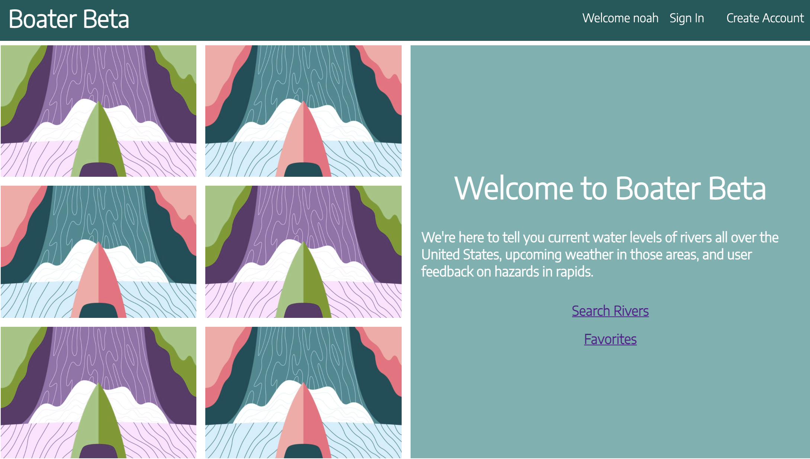

## Capstone FrontEnd 

## Deployed Url
https://hardcore-jackson-68ff7b.netlify.app/riverdetails

## Sample
******

## Descriptions
******************
This is front end application was built with the Reactjs framework in conjunction with some elements from material ui. This site works in conjuction with a backend that I built out in Nodejs. This sites overall premise is to help whitewater kayakers follow water level on rivers throughout the United States and follow upcoming weather patterns in that area. The site pulls information directly from usgs river data api and the national weather api. Data from these apis was not seeded into the backend because of they frequently update. Users are able to leave comments on rivers to provide updates on potential hazards that they may have encountered on rivers. User authentication was established so that users are able to create an account and login. They are then able to save their favorite rivers to their account. 

## Installation
*********
To contribute to this work simply fork and clone the repository and then run npm install. All packages will be installed upon that command. In order to have access to the backend that I created you can reach out so I can add your site to list of cors approved domains.

## API's Used
- Deployed API that I built is boatertalk.herokuapp.com. This is created in order to store user authentication information and user comments on each river.
- USGS API is used to get up to date information on rivers across the US.
-National Weather API is used to get up to date information on weather patterns in that area.
